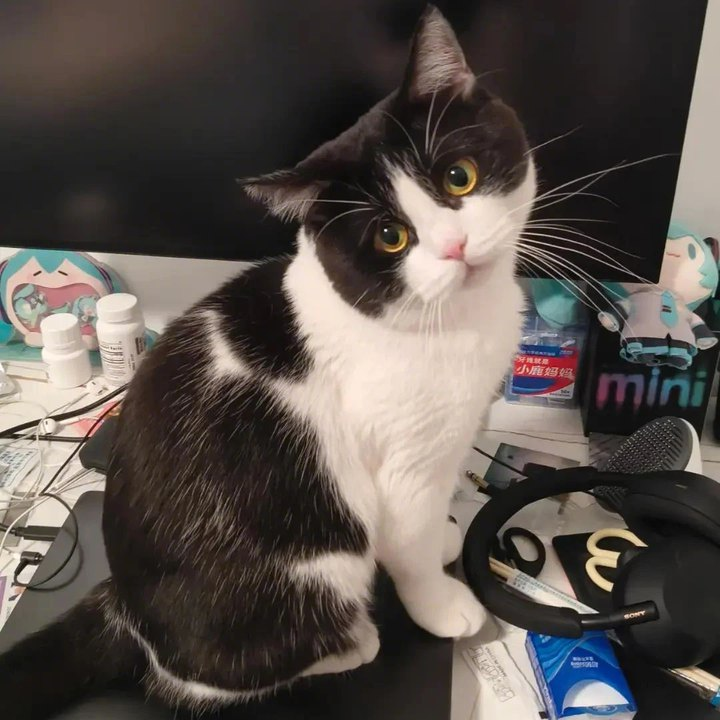

## About Me {#about-me}

Hi :D ! I'm a ... Ph.D. student at The Chinese University of Hong Kong, Shenzhen, advised by [Prof. Zhizheng Wu](https://drwuz.com/). I spent my undergraduate studies at Fudan University, majoring in software enginnering, with [Prof. Bihuan Chen](https://chenbihuan.github.io/) and [Prof. Kaifeng Huang](https://kaifeng-h.github.io/).

Beyond academia, I'm an amateur music producer with over 2 million plays on [netease cloud music](https://music.163.com/#/artist/album?id=12030266). In my free time, I enjoy playing rhythm games like [osu!](https://osu.ppy.sh) and watching slice-of-life (iyashikei) anime like [miss kobayashi's dragon maid](https://maidragon.jp/) (i like [elma](https://maid-dragon.fandom.com/wiki/Elma) very much).

<!-- **I'm currently a research intern at [ByteDance Seed](https://seed.bytedance.com/), developing the SeedMusic model.** -->

<a class="tihu-link" href="./assets/img/tihu.jpg" target="_blank">"鹈鹕" is a black & white british shorthair</a>, ... old. He became my family member since November 2024, and has lived with me for <strong id="tihu-days">...</strong> days.

## Research Interests {#research-interests}

**<u>High-Quality</u>** and **<u>Controllable</u>** Music Generation:
- **High-Quality:** speech/singing voice enhancement (de-noise, de-reverb, super-resolution, etc.), music restoration.
- **Controllable:** speech/singing voice generation/editing, accompaniment generation, music-to-music generation.

<!--  -->









